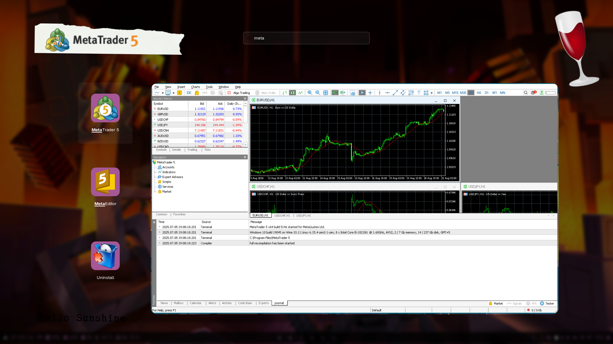

# 🧙‍♂️ MetaTrader 5 Installer Script for Arch Linux

> A fully automated bash script to install **MetaTrader 5** (MT5) on Arch Linux using **Wine Staging**.



## ⚠️ Warning: Uses Wine-Staging

This script uses `wine-staging`, the **experimental** branch of Wine. It includes bleeding-edge patches that may offer **better compatibility** but **may also cause instability**. Use with caution if you rely on a stable Wine environment.

## 📦 Dependencies

The following packages will be installed if not already present:

| Package        | Purpose                                    |
| -------------- | ------------------------------------------ |
| `wine-staging` | Runs Windows applications on Linux         |
| `wine-gecko`   | Adds Internet Explorer rendering support   |
| `winetricks`   | Helps install DLLs, fonts, and tweaks      |
| `wget`         | Used to download the MT5 installer         |
| `figlet`       | Fancy terminal banners (optional)          |
| `lolcat`       | Rainbow-colored terminal output (optional) |

> 🛠 Already installed packages will **not** be reinstalled.

## 🚀 How to Use

### 1. Clone or Download the Script

```bash
git clone https://github.com/<your-username>/mt5-installer-arch.git
cd mt5-installer-arch
chmod +x install_mt5_arch.sh
```

Or download directly:

```bash
curl -O https://raw.githubusercontent.com/<your-username>/mt5-installer-arch/main/install_mt5_arch.sh
chmod +x install_mt5_arch.sh
```

### 2. Run the Script

```bash
./install_mt5_arch.sh
```

## 🔍 What This Script Does

1. **Checks internet connectivity**
2. **Installs required dependencies**
3. **Sets up an isolated Wine prefix** at `~/.wine_mt5`
4. **Downloads the MT5 installer**
5. **Launches the installer** using Wine

## 🏁 After Installation

You can run MetaTrader 5 anytime using:

```bash
WINEPREFIX=~/.wine_mt5 wine "$HOME/.wine_mt5/drive_c/Program Files/MetaTrader 5/terminal64.exe"
```

## 🧹 Uninstallation

To remove MetaTrader 5 and the Wine environment:

```bash
rm -rf ~/.wine_mt5 mt5setup.exe
```

## 📁 File Structure

```
.
├── install_mt5_arch.sh      # Main installer script
├── mt5setup.exe             # (Downloaded) MT5 installer
└── ~/.wine_mt5              # Wine prefix containing MT5
```

## 🤖 Customization Ideas

- Add CLI options like `--skip-download`, `--silent`
- Automatically launch MT5 after install
- Customize Wine settings via `winecfg`

## 📄 License

This project is licensed under the MIT License. Feel free to use, modify, and distribute — just give credit!
